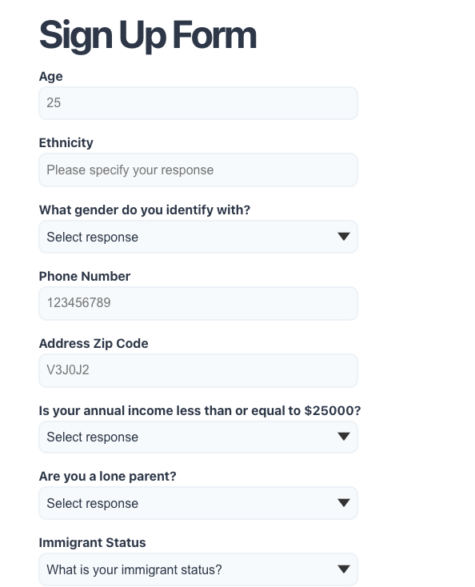
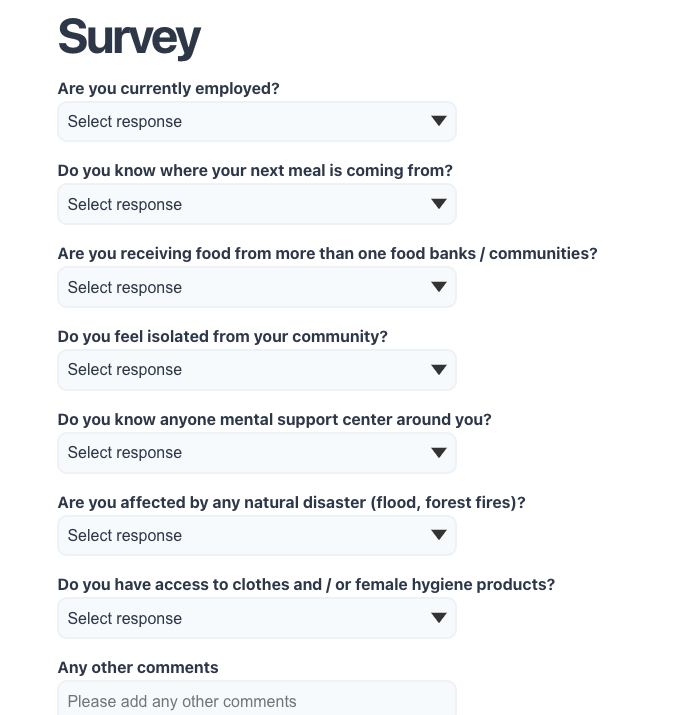
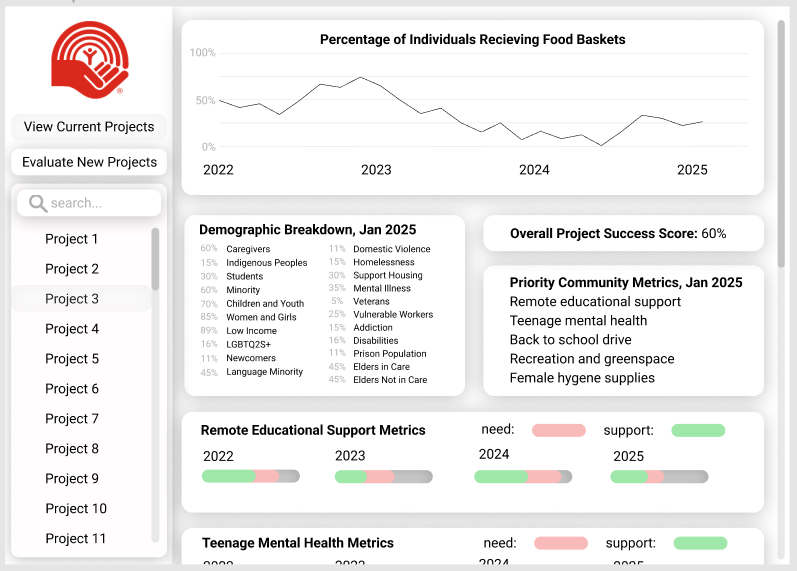
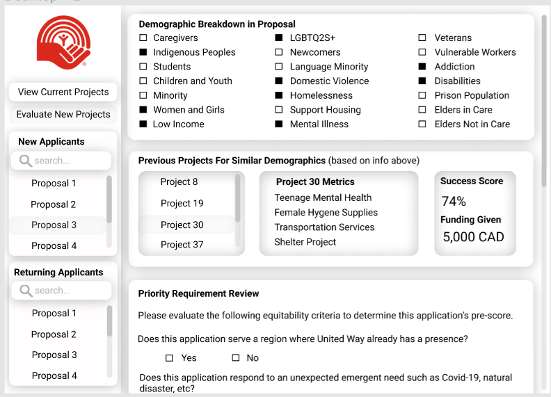

# UWHackathonProject
This project is created for a hackathon between Northeastern University and United Way.

# Project Description

Our project provides a way to collect more granular data from the individuals in communities who benefit from United Way's funding. This project consists of a web app that users receiving support at food hubs can access and fill out to obtain a QR code. They are then able to scan this QR code everytime they return to the foodhub. This gives us a low friction way to track how frequently some users go to a certain foodhub, roughly how many people are being serviced, and how many are going to more than one food hub supported by United Way. Our project also contains an additional form that can be filled out by community individuals monthly, biannually, or as often as United Way would like to collect this granular data. The information in this ongoing granular data collection could then ultimately be used to generate community specific metrics, to measure the success of a project in a community, by the community's own terms.

# Usage

# Visuals

Examples of our initial intake form and a recurring form, which could be further developed with insight from a community specialist:

The following image demonstrate the type of dashboard that could be built with this information after long term data collection:

# Installation and Requirements

## Back - end

In the first step, download `homebrew` which is a open source package management software. Once installed, open the terminal on a Mac / Window and type `brew install mysql`.  

Next, download the project files from `Code` on Github. Unzip the files, open `mysql` and `run createDB.sql` in it.  

For the remaining files, open in any `Java IDE`, open `applications.properties` to update instance, id and password to your configuration.

For the final step, run the `main.java` file.

## Front - end
### Available Scripts

In the project directory, you can run:

#### `npm install`
To install the dependencies package.

#### `npm start`

Runs the app in the development mode. 
Open [http://localhost:3000](http://localhost:3000) to view it in the browser.

The page will reload if you make edits. 
You will also see any lint errors in the console.

#### `npm test`

Launches the test runner in the interactive watch mode. 
See the section about [running tests](https://facebook.github.io/create-react-app/docs/running-tests) for more information.

#### `npm run build`

Builds the app for production to the `build` folder. 
It correctly bundles React in production mode and optimizes the build for the best performance.

The build is minified and the filenames include the hashes. 
Your app is ready to be deployed!

See the section about [deployment](https://facebook.github.io/create-react-app/docs/deployment) for more information.

#### `npm run eject`

**Note: this is a one-way operation. Once you `eject`, you can’t go back!**

If you aren’t satisfied with the build tool and configuration choices, you can `eject` at any time. This command will remove the single build dependency from your project.

Instead, it will copy all the configuration files and the transitive dependencies (Webpack, Babel, ESLint, etc) right into your project so you have full control over them. All of the commands except `eject` will still work, but they will point to the copied scripts so you can tweak them. At this point you’re on your own.

You don’t have to ever use `eject`. The curated feature set is suitable for small and middle deployments, and you shouldn’t feel obligated to use this feature. However we understand that this tool wouldn’t be useful if you couldn’t customize it when you are ready for it.

# Roadmap

There are both short term and long term steps for this project. In the short term, the next steps are to transfer the website from a local host to live production, usable by the communities that recieve funding and support from United Way.
